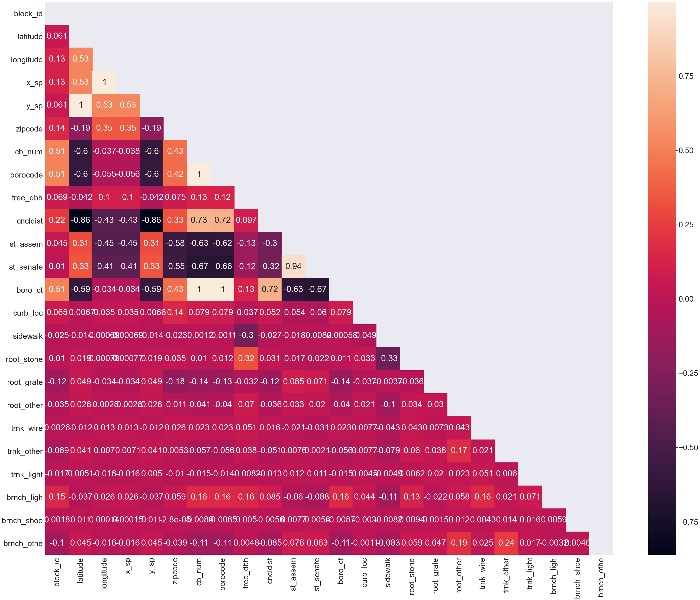
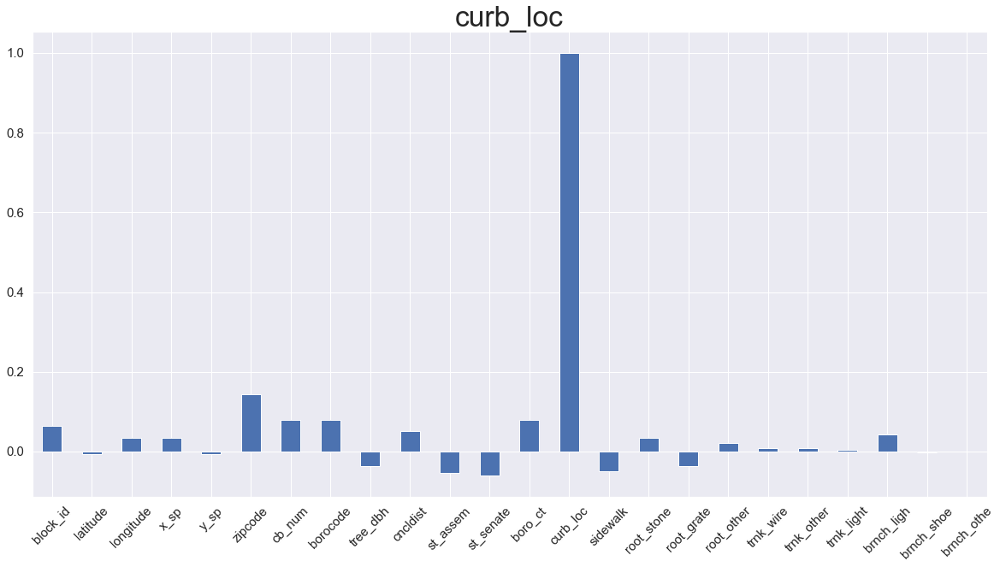
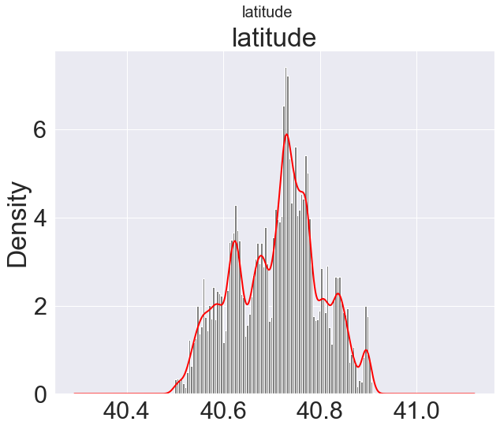

# nyc-trees
---


- Repository: `nyc-trees`
- Type of Challenge: `Learning`
- Duration: `1 day`
- Deadline: `12/03/2021 04:00 PM`
- Deployment strategy :
  - Github page
- Team challenge : `solo`

## Mission objectives

- Be able to use pandas
- Be able to clean a data set

## The Mission

The Department of Environmental Conservation, from New York city, has recently made the news by telling the people that they needed their help. Indeed, their request is simple: They needed the people of New York city, whether young or old, to go to the nearest tree in their street and gather information about that tree. This is all in an effort to make the population aware that nature is important, even in big Metropolis like NYC. Now that they have heard back from the people, the DEC noticed that they missed a crucial step. They forgot to give the people a data collection guide, and so the data they received back is a bit messy.

We need to help them clean the data so that they can begin to raise awareness to ecological issues, such as climate change ?

# About Running the Program

* **Python version:** `3.8.5`

**Imporant Libaries:**

| Library       | Used to                                        |
| ------------- | :----------------------------------------------|
| numpy		|to work around multi-dimensional of generic data|
| os		|to work around system path.			 |
| pandas        |to manupulate the data.			 |
| sodapy        |to downloading the data set			 |
| seaborn       |to to have beautiful visualization 		 |
| matplotlib    |to to have beautiful visualization ploting	 |
| sklearn	|to Encoding the "BINARY CATAGORICAL" Variable	 |

**Note:** Just use command below to install the required libary with correct version to run the program smoothly.

"pip install -r requiement.txt"

# Architecture

```
nyc-trees
│   README.md               :explains the project
│   requirements.txt        :packages to install to run the program
│   
│   download.ipynb  	    :script to download a differently sized dataset.
│   main.ipynb      	    :script to run in order to start the program
│   	
│   data_files 		    :directory contains all maintainted .csv files.

```

---
# Instruction
#### How to get filter data

1. Setup python environment  `3.8.5`
2. Install all libaries `pip install -r requirements.txt`
3. Download important "data_10000.csv" files `download.ipynb` or just use sample data set provided.
4. Run the `main.ipynb` in jupyter notebook
5. Run all code
6. Have a look on the statistics genereted.
7. Filtered data are saved inside "data_files"


# Data visualization

1. Correlation figure to understand the correation of each column with one another



2. Individual Correlation this help us understand the correation of any individual column of your choice with all other columns



3. Data distribution visualization of any individual column of your choice



---
# Next Step

1. Futher Filter the data.
2. Better data distribution visualization

